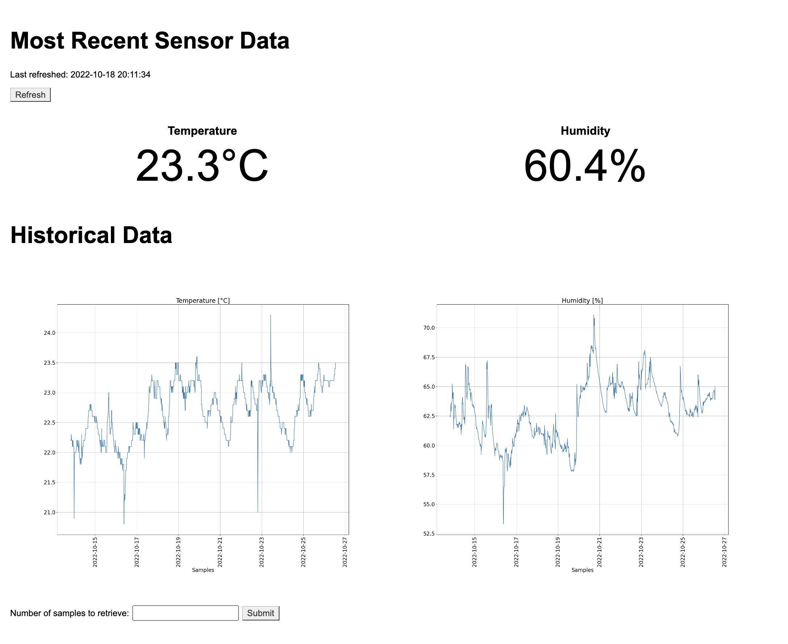

============
room-comfort
============

Temperature and humidity live visualization in browser using Raspberry Pi.

In browser screenshot:

Requirements
============

Hardware:

* Raspberry Pi
* A breadboard
* Breadboard wires
* 10k ohm resistor (Brown, Black, Orange, Gold)
* DHT22 temperature and humidity sensor (DHT11 works as well)

Hardware setup instructions `here <https://pimylifeup.com/raspberry-pi-humidity-sensor-dht22/>`__.

Python packages:

* adafruit-circuitpython-dht
* flask
* matplotlib
* sqlite3

Usage
=====
Run following in terminal:

.. code-block::

  bash run_temp_hum.sh
